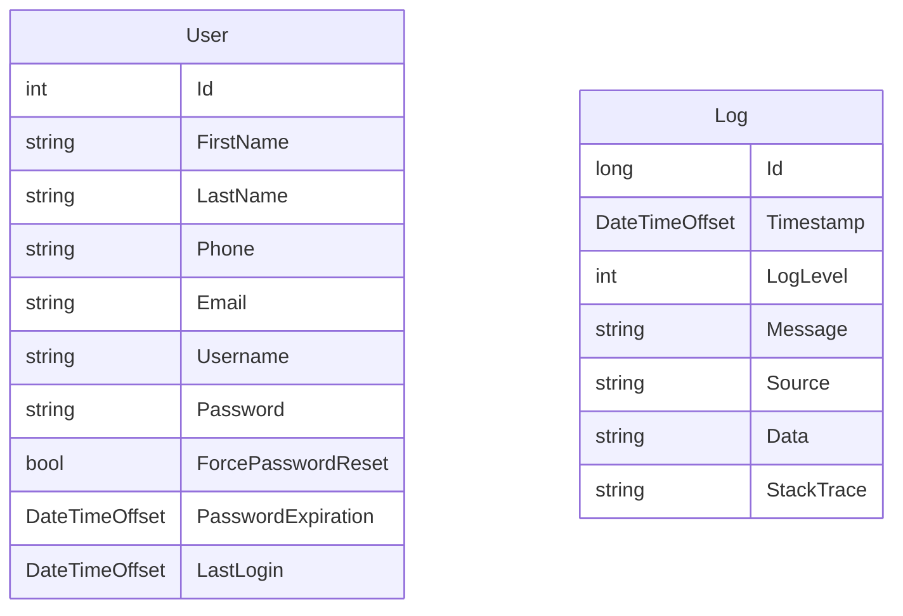

# Authentication Service

The Authentication service is responsible for managing users and JWTs for the
Agrigate API.

## Overview

A single supervisor is at the root of the Authentication service, which
oversees a User Manager. The User Manager is responsible for handling all
incoming user requests, which are forwarded to a short-lived actor.

## Data Model

The Authentication service utilizes the following data model.

- **User**: A user of the Agrigate platform

