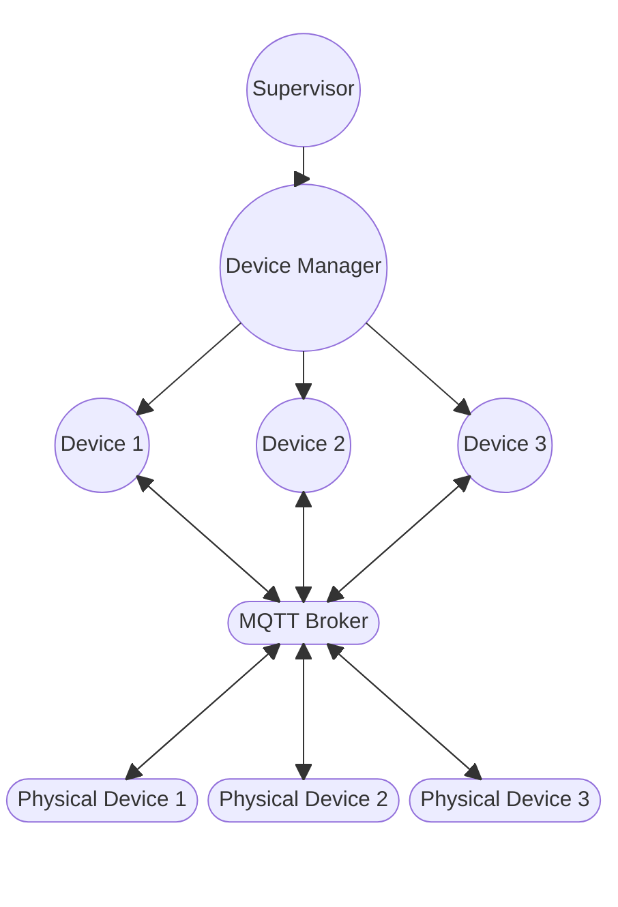
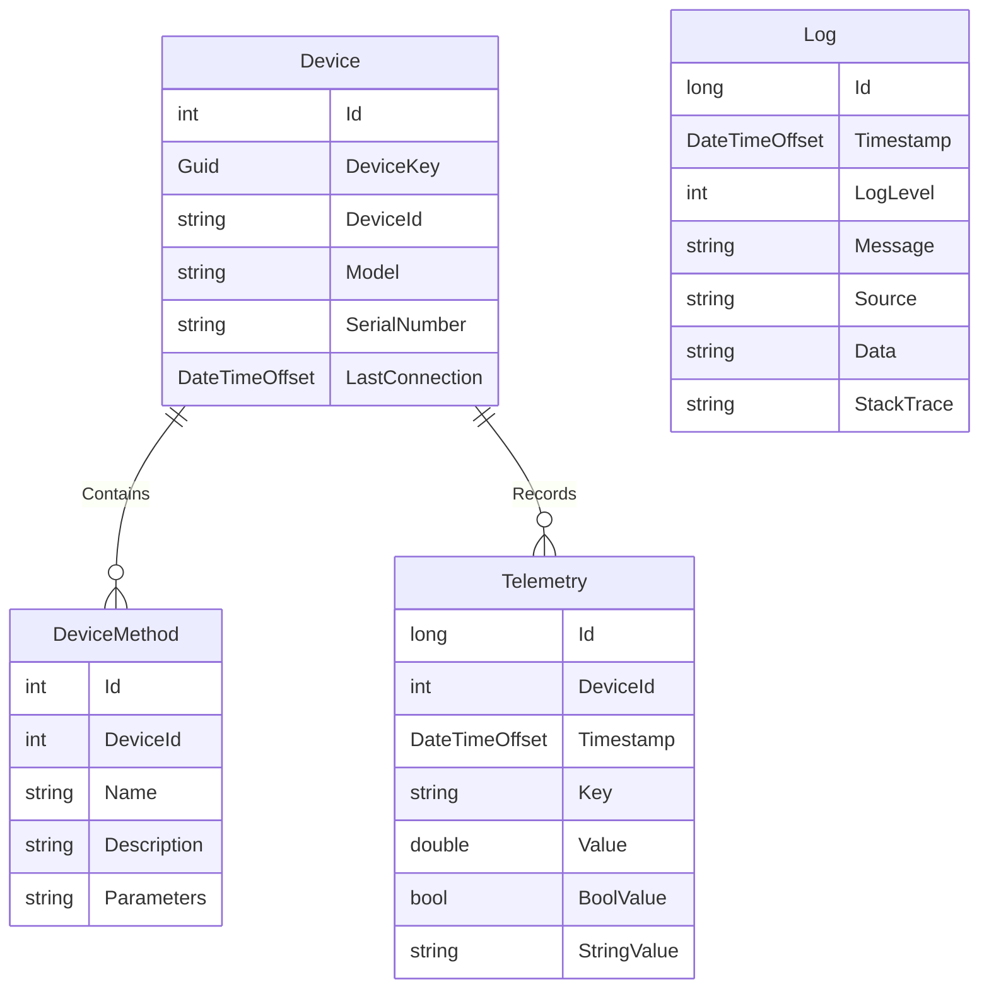

# IoT Service

The IoT service is responsible for communicating and interacting with various
devices that connect to the Agrigate platform.

## Overview

A single supervisor is at the root of the IoT Service, which oversees the Device
Manager. The Device Manager is responsible for monitoring connect and disconnect
events coming from the IoT broker.

On every connect or disconnect event, the Device manager will create or destroy
a device actor for the physical device.

The device actors are responsible for communicating with their associated
physical devices, and maintain a separate connection to the MQTT broker.

## Data Model

The IoT service utilizes the following data model

- **Device**: A physical device that has connected to the Agrigate platform
- **DeviceMethod**: A method that is exposed on the device and can be initiated
  remotely by Agrigate
- **Telemetry**: Sensor or other data received from the device

