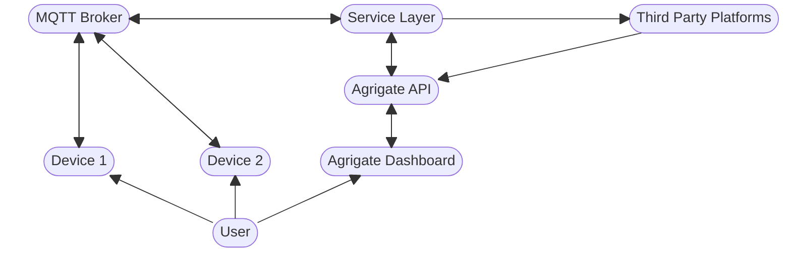

# Platform

The Agrigate platform primarily consists of a web dashboard, web api, and
smaller microservices that make up the service layer.
[Akka.Net](https://petabridge.com/) is used to tie the various services and API
together via Akka.Remote, and services can be connected to manually through
[Petabridge.CMD](https://cmd.petabridge.com/).

There is also an MQTT broker that allows IoT devices to connect, and serves as
a broker for event-based messages between the various Agrigate services.

If configured, certain services will utilize 3rd party platforms, and any 3rd
party webhooks should be setup to connect with the appropriate API endpoints

