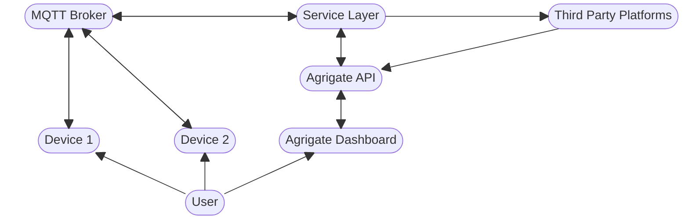

# Platform

```mermaid
block-beta
    columns 5

    broker(["MQTT Broker"]) space:1 services(["Service Layer"]) space:1 3rdParty(["Third Party Platforms"])
    space:5
    space:2 api(["Agrigate API"]) space:2
    space:5
    device(["Device 1"]) device2(["Device 2"]) dashboard(["Agrigate Dashboard"]) space:2
    space:5
    space:1 user(["User"]) space:3

    api --> services
    api --> dashboard
    broker --> device
    broker --> device2
    broker --> services
    dashboard --> api
    device --> broker
    device2 --> broker
    services --> broker
    services --> api
    services --> 3rdParty
    user --> device
    user --> device2
    user --> dashboard
    3rdParty --> api
```
