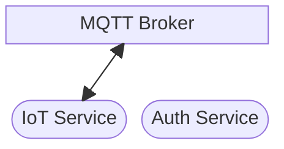
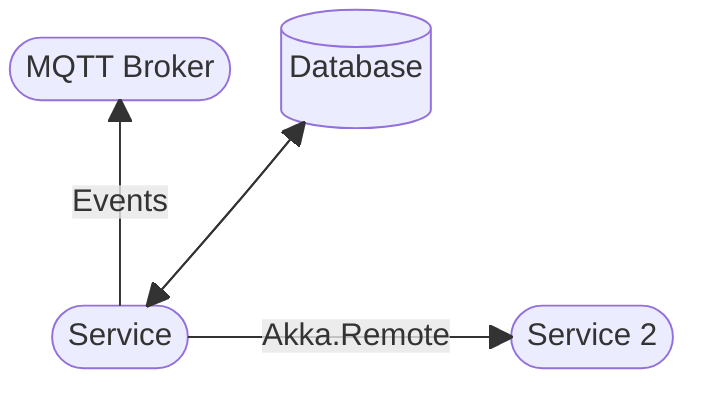

# Services

The main business logic for Agrigate occurs in the service layer, which is made
up of a variety of microservices that are responsible for one aspect of
Agrigate, such as Authentication, IoT, Notifications, etc.

## Overview

Here, you can see which services interact with each other and the message broker
at a high level.

## Service Components

Each service consists of the following components:

- A worker service, which performs the associated business logic
- A database (if required) to store essential information

Each service utilizes Akka.Remote in order to communicate with other services
when required and, in some situations, events will be published to the MQTT
broker in pre-specified channels. These channels can then be subscribed to by
other services, which will react accordingly.

