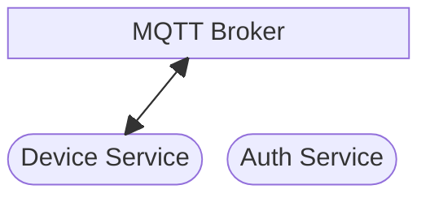
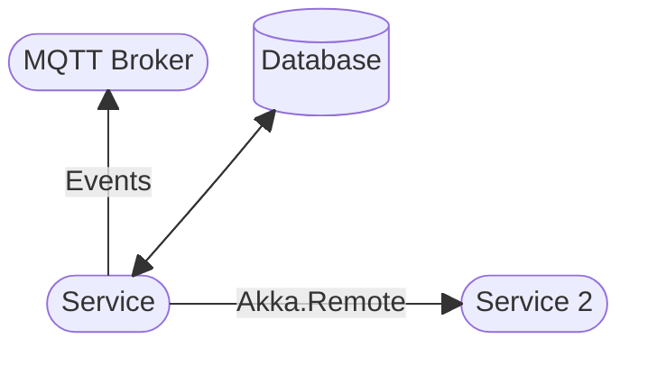

# Services

## Overview

```mermaid
block-beta
    columns 2

    broker["MQTT Broker"]:2
    space:2
    devices(["Device Service"]) auth(["Auth Service"])

    broker --> devices
    devices --> broker
```

## Service Components

```mermaid
block-beta
    columns 3

    broker(["MQTT Broker"]) database[("Database")] space:1
    space:3
    service(["Service"]) space:1 service2(["Service 2"])

    database --> service
    service -- "Events" --> broker
    service --> database
    service -- "Akka.Remote" --> service2
```
