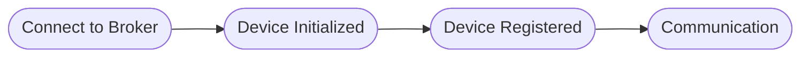

# IoT

A major aspect of Agrigate is the ability to integrate with IoT devices for data
collection and automation. This page describes the high-level flow of data and
use cases involving these devices.

## Device Communication

Agrigate utilizes an MQTT broker to communicate with various IoT Devices. A
device manager will listen to connection events from the broker and create or
destroy device actors as required.

Once the device actor has been created, it will register the physical device
with Agrigate if needed. Once registration has completed, all communications
between Agrigate and the physical device moves through that particular actor.

