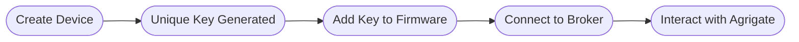

# IoT

A major aspect of Agrigate is the ability to integrate with IoT devices for data
collection and automation. This page describes the flow of data and use cases
involving these devices.

## Device Registration

Agrigate utilizes an MQTT broker to communicate with IoT Devices, but will only
communicate with or act on devices that are pre-registered within the platform.

